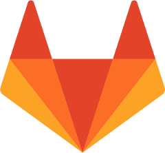
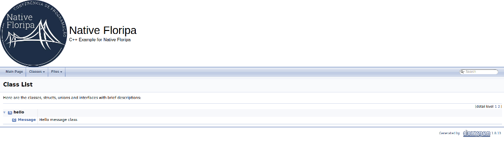
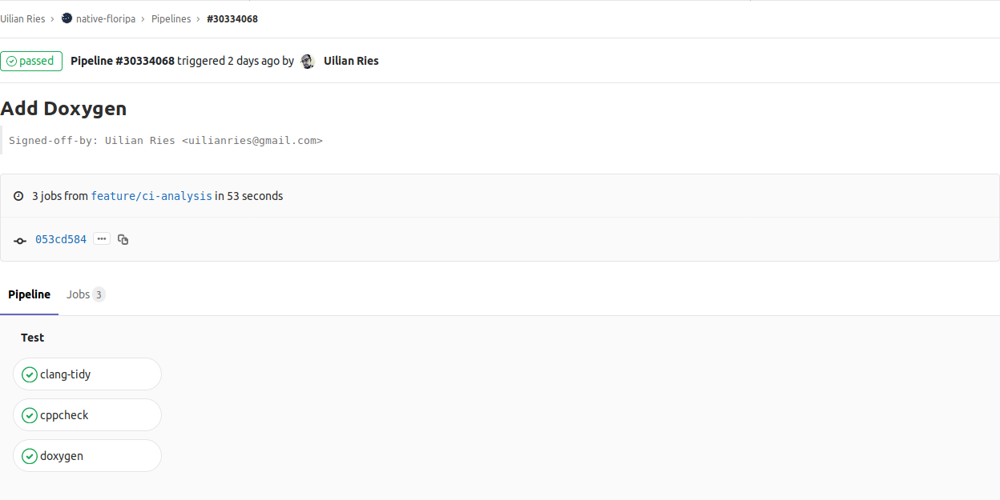
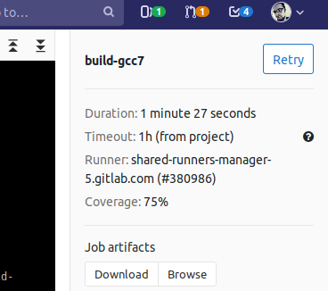
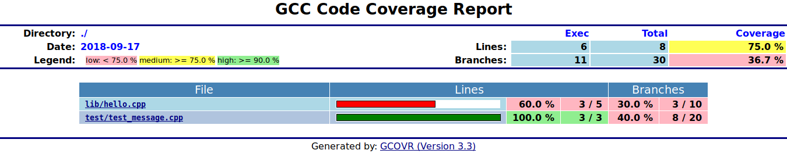
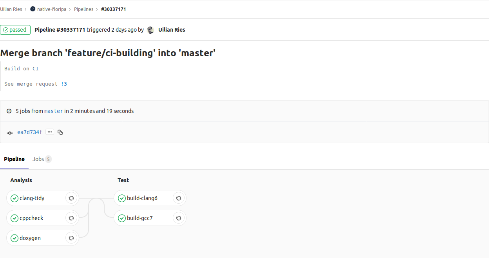
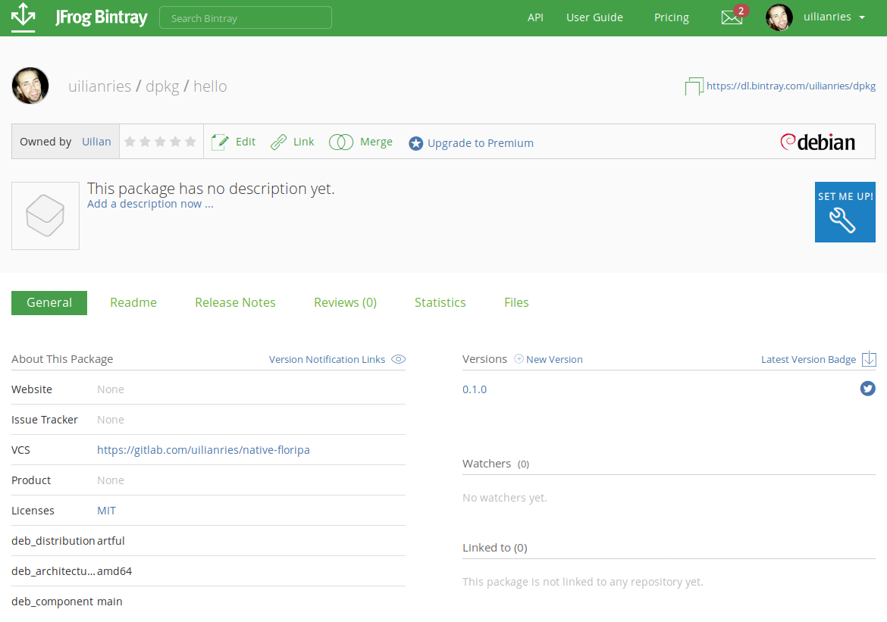
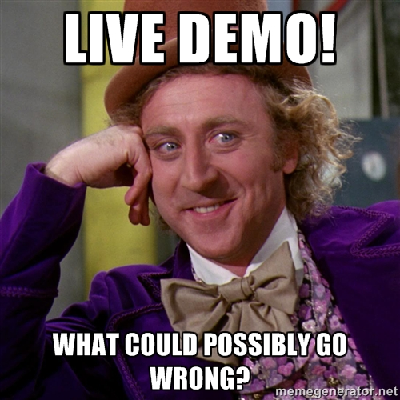

## Gitlab

#### Construindo aplicações C++ com Gitlab



---?image=assets/img/orange-dark.png
@title[About me]

@div[left-70]
Hello!
<br>
<br>
**Uilian Ries**
<br>
<br>
C++ and Python Developer
<br>
Work at **@khomp**
<br>
<br>
@uilianries
<br>
@fa[github] @fa[twitter] @fa[linkedin]
@divend

@div[right-30]

@divend

---?image=assets/img/vaga-khomp.png
@title[Khomp]

---?image=assets/img/purple.png
@title[Agenda]

#### AGENDA

* Rise of the Fox
* Sobre Gitlab
* Gitlab CI
* Projeto C++
* Analisar + Doxygen
* Compilar + Test
* Deploy + Upload

---?image=assets/img/gitlab-cover.png

### RISE OF THE FOX


Jun 4, 2018

---?image=assets/img/gitlab-background-moving.png

---?image=assets/img/purple.png
@title[A New Project]

Let's start a new C++ project!

What does it need?

@div[left-50]
<ul>
  <li>Cppcheck</li>
  <li>Clang Tidy</li>
  <li>Doxygen</li>
  <li>Unit Test (Catch2)</li>
  <li>Generate .DEB package</li>
</ul>
@divend

---?image=assets/img/purple.png
@title[Project Structure]

```
├── CMakeLists.txt
├── conanfile.txt
├── docs
│   ├── Doxyfile
├── include
│   └── hello
│       └── hello.hpp
├── lib
│   └── hello.cpp
└── test
    ├── CMakeLists.txt
    └── test_message.cpp
```

---?image=assets/img/orange-dark.png

#### CPPCHECK

* A static code analysis tool for the C and C++
<br>
<br>
```shell
$ cppcheck *.cpp --enable=all --language=c++
```

---?image=assets/img/orange-dark.png

#### CPPCHECK
@title[cppcheck - gitlab recipe]

.gitlab-ci.yml

```yaml
cppcheck:
  image: ubuntu:bionic
  before_script:
    - apt update
    - apt install -y --no-install-recommends cppcheck=1.82-1
    - cppcheck --version
  script:
    - cppcheck lib/*.cpp --verbose --enable=all --inconclusive --language=c++ --error-exitcode=1
```

@[1-1]
@[2-2]
@[3-6]
@[7-8]

---?image=assets/img/orange-dark.png
@title[cppcheck - gitlab CI]


---?image=assets/img/red.png
#### CLANG TIDY

* A clang-based C++ “linter” tool
<br>
<br>
```shell
$ clang-tidy test.cpp -checks=-*,clang-analyzer-*
```

---?image=assets/img/red.png
#### CLANG TIDY
@title[clang tidy - gitlab recipe]

.gitlab-ci.yml

```yaml
clang-tidy:
  image: base/archlinux:2018.09.01
  variables:
    CC: clang
    CXX: clang++
  before_script:
    - pacman -Syu --needed --noconfirm clang-tools-extra=6.0.1-2
    - clang-tidy --version
  script:
    - clang-tidy -warnings-as-errors="*" -checks="-*,clang-analyzer-*,-clang-analyzer-alpha*" lib/hello.cpp -- -Iinclude
```

@[1-1]
@[2-2]
@[3-5]
@[6-8]
@[9-10]

---?image=assets/img/red.png
@title[clang tidy - gitlab CI]


---?image=assets/img/green.png
#### DOXYGEN

* A documentation generator, a tool for writing software reference documentation
<br>
<br>
```shell
$ doxygen docs/Doxyfile
```

---?image=assets/img/green.png
#### DOXYGEN
@title[doxygen - gitlab recipe]

.gitlab-ci.yml

```yaml
doxygen:
   image: alpine:3.7
   before_script:
     - apk update
     - apk add --no-cache -t .required_apks doxygen=1.8.13-r1 graphviz=2.40.1-r0
     - mkdir -p build/docs
   script:
     - doxygen docs/Doxyfile
   artifacts:
     paths:
       - build/docs/html/
```

@[1-1]
@[2-2]
@[3-6]
@[7-8]
@[9-11]

---?image=assets/img/green.png
@title[doxygen - gitlab CI]


---?image=assets/img/green.png

#### DOXYGEN



---?image=assets/img/purple.png

#### STAGES

[x] **Analysis**
[ ] **Testing**
[ ] **Deployment**



---?image=assets/img/purple.png

#### BUILDING
* CMake
* Conan
* Gcc
* Clang

---?image=assets/img/purple.png

#### TESTING
* Catch2
* Valgrind
* gcovr

---?image=assets/img/purple.png


#### CMake + Conan + Catch2
* A application for managing the build process of software
* A C and C++ Package Manager for Developers
* A modern header-only, test framework for unit-tests

---?image=assets/img/purple.png

#### HOW TO BUILD

```
$ mkdir build && cd build
$ cmake .. -DCMAKE_BUILD_TYPE=Release -DBUILD_TESTS=OFF
$ cmake --build .
```

---?image=assets/img/purple.png

#### ADDING TESTS

```
$ mkdir build && cd build
$ conan install ..
$ cmake .. -DCMAKE_BUILD_TYPE=Debug
$ cmake --build . --target test
$ cmake --build . --target memcheck
$ cmake --build . --target coverage
```

---?image=assets/img/purple.png

```yaml
build-gcc7:
    image: lasote/conangcc7
    before_script:
      - sudo apt update
      - sudo apt install gcovr
    script:
      - mkdir -p build && cd build
      - conan install ..
      - cmake ..
      - cmake --build .
      - cmake --build . --target test
      - cmake --build . --target memcheck
      - cmake --build . --target coverage
```

@[1-1]
@[2-2]
@[3-5]
@[6-8]
@[9-10]
@[11-11]
@[12-12]
@[13-13]

---?image=assets/img/purple.png


---?image=assets/img/purple.png

#### CODE COVERAGE

* Add code coverage result for Download

---?image=assets/img/purple.png

```yaml
build-gcc7:
    image: lasote/conangcc7
    before_script:
      - sudo apt update
      - sudo apt install gcovr
    script:
      - mkdir -p build && cd build
      - conan install ..
      - cmake ..
      - cmake --build .
      - cmake --build . --target test
      - cmake --build . --target memcheck
      - cmake --build . --target coverage
    artifacts:
      paths:
        - build/coverage/
        - build/test/Testing/Temporary/
```

@[14-17]

---?image=assets/img/purple.png

#### COVERAGE





---?image=assets/img/purple.png

#### STAGES

[X] **Analysis**
[X] **Testing**
[ ] **Deployment**



---?image=assets/img/green.png

#### DEPLOYING

* Download the project as a package
* Use CPack to generate .DEB package
* Upload package to Bintray

---?image=assets/img/green.png


* Bintray offers native support for all major package formats

---?image=assets/img/green.png

```yaml
deploy-bintray:
    image: lasote/conangcc7
    before_script:
      - sudo apt update
      - sudo apt install -y --no-install-recommends curl
    script:
      - cd build
      - cmake .. -DCMAKE_BUILD_TYPE=Release -DBUILD_TESTS=OFF
      - cmake --build .
      - cpack -G DEB .
    after_script:
      - curl -T build/hello-0.1.0.deb -uuilianries:${BINTRAY_API_KEY} "https://api.bintray.com/content/uilianries/dpkg/hello/0.1.0/pool/main/h/hello/hello_0.1.0_amd64.deb;deb_distribution=testing;deb_component=main;deb_architecture=i386,amd64;publish=1"
    artifacts:
      paths:
        - build/*.deb
```

@[1-1]
@[2-2]
@[3-5]
@[6-10]
@[11-12]
@[13-15]

---?image=assets/img/green.png


---?image=assets/img/green.png



---?image=assets/img/green.png



[DEMO](https://gitlab.com/uilianries/native-floripa/pipelines/30672693)

---?image=assets/img/green.png

#### CONCLUSION

* C and C++ is not just about language standard
* There are a lot of FOSS tools
* Gitlab is a good opportunity to standardize your environment

---?image=assets/img/purple.png

#### REFERENCES

* https://gitlab.com/uilianries/native-floripa
* https://bintray.com/uilianries/dpkg/hello
* https://github.com/conan-io/conan
* https://github.com/bincrafters/conan-catch2
* https://docs.gitlab.com/ee/ci/yaml

---?image=assets/img/purple.png

### THANK YOU!

##### Questions ?

You can find me on:  

**@uilianries** - twitter, github  
cpplang.slack.com - channel #conan or #bincrafters  
uilianries@gmail.com  
https://conan.io
